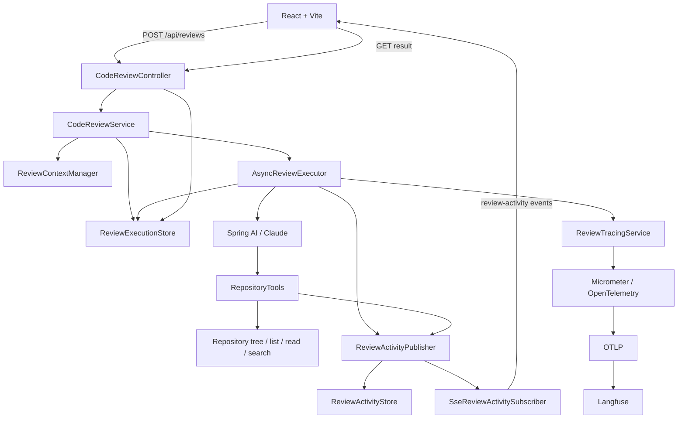

# Architecture

The application reviews a local repository asynchronously. The browser receives a review ID immediately, follows operational activity through SSE, and reads the stored execution result when the review reaches a terminal state.

## Review lifecycle

`CodeReviewService` validates the supplied directory, creates a `ReviewContext`, stores a `PENDING` `ReviewExecution`, publishes `REVIEW_STARTED`, and returns the generated ID. `AsyncReviewExecutor.execute` is annotated with `@Async`; it records `RUNNING`, asks the Spring AI `ChatClient` to call repository tools as needed, converts the final JSON into `CodeReviewResponse`, then stores either `COMPLETED` or `FAILED`.

The result endpoint exposes `ReviewExecution`, whose status is one of `PENDING`, `RUNNING`, `COMPLETED`, or `FAILED`. A completed execution carries the review result; a failed one carries a user-friendly error message.

## Repository boundary

`ReviewContextManager` maps a UUID to a normalized repository root. `RepositoryTools` receives the review ID and repository-relative paths, resolves paths through that server-owned context, and rejects paths outside the root. It excludes common generated and tooling directories such as `.git`, `target`, `node_modules`, `build`, and `dist`.

## Activity and streaming

`AsyncReviewExecutor` and `RepositoryTools` publish `ReviewActivityEvent` records through `ReviewActivityPublisher`. `DefaultReviewActivityPublisher` timestamps, stores, logs, and fans each event out to subscribers. `InMemoryReviewActivityStore` retains activity by review ID for the process lifetime.

`SseReviewActivitySubscriber` replays existing events to a newly connected `SseEmitter`, then forwards live events named `review-activity`. It supports multiple emitters for one review and removes them on completion, timeout, error, or terminal review activity. The React UI de-duplicates replayed/live events and falls back to five-second polling if its EventSource closes.

| Mechanism | Purpose |
| --- | --- |
| `ReviewActivityEvent` | User-facing operational progress, such as file reads and completion. |
| SLF4J | Application and developer diagnostics. |
| Langfuse | AI/agent observability: spans, model observations, provider metadata, and telemetry where available. |

## Observability

Actuator supplies the tracing infrastructure. Micrometer’s OpenTelemetry bridge provides the injected `Tracer`; the OTLP exporter sends traces to the endpoint configured by `LANGFUSE_OTEL_ENDPOINT` with `LANGFUSE_AUTH_HEADER`.

`ReviewTracingService` starts an `ai-code-review` span tagged with `review.id` and repository name. `AsyncReviewExecutor` adds terminal status and finding-count tags, and records failures on the span. Spring AI produces model observations; `ChatModelCompletionContentObservationFilter` maps available request instructions and response completions to `langfuse.observation.input` and `langfuse.observation.output`. Model, token, and latency information is visible when Spring AI, the provider, and the telemetry pipeline supply it.

Prompt/completion observation is sensitive. It may export prompts, model responses, source-code excerpts, and findings or evidence to the configured telemetry backend. The application currently enables Spring AI prompt/completion logging, so configure access and retention deliberately.
